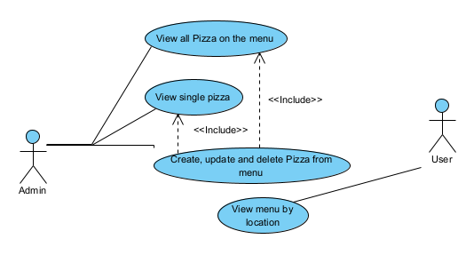
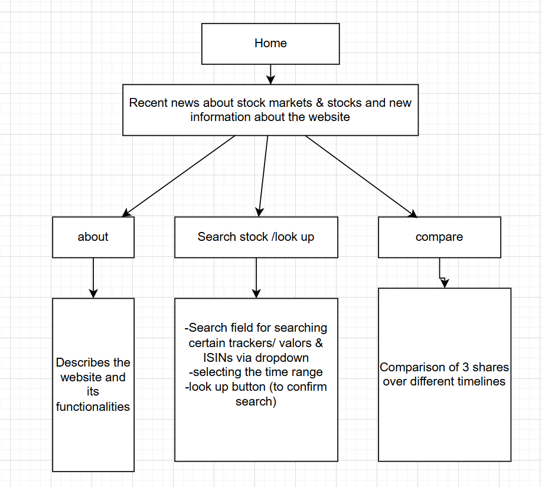
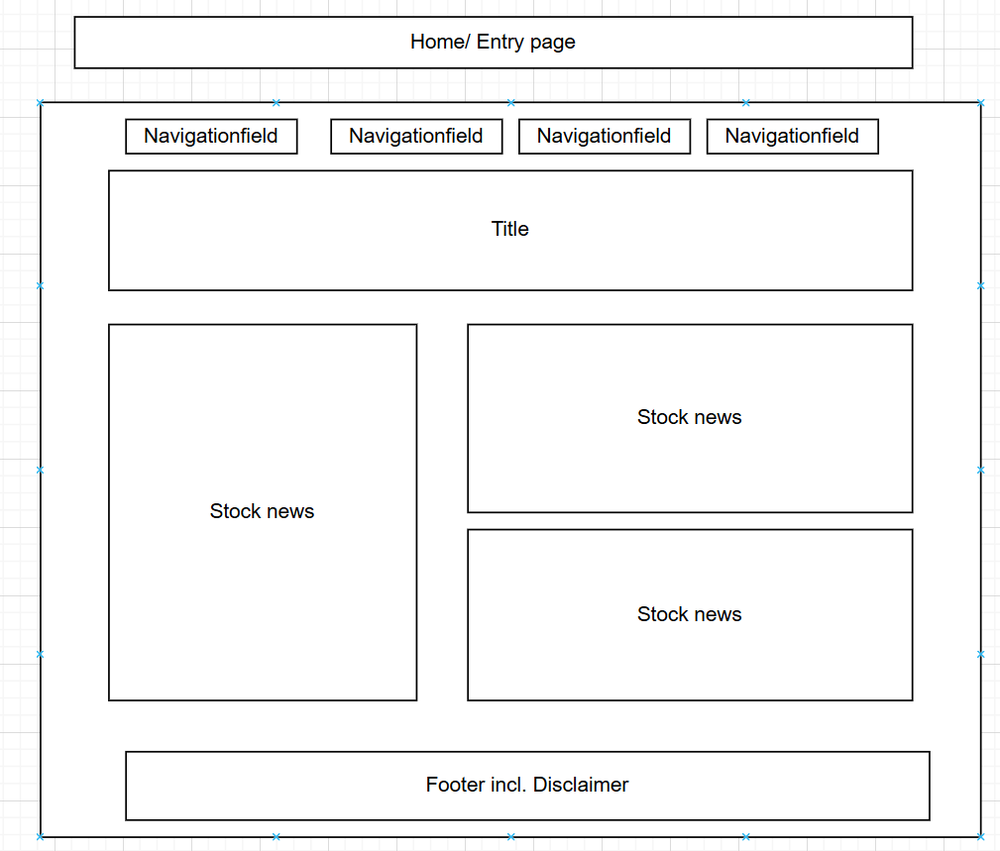
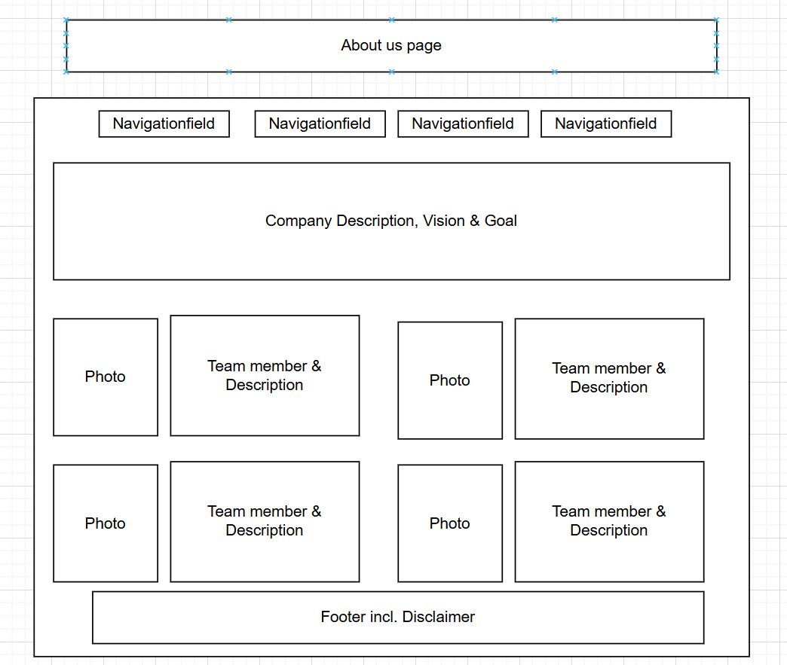
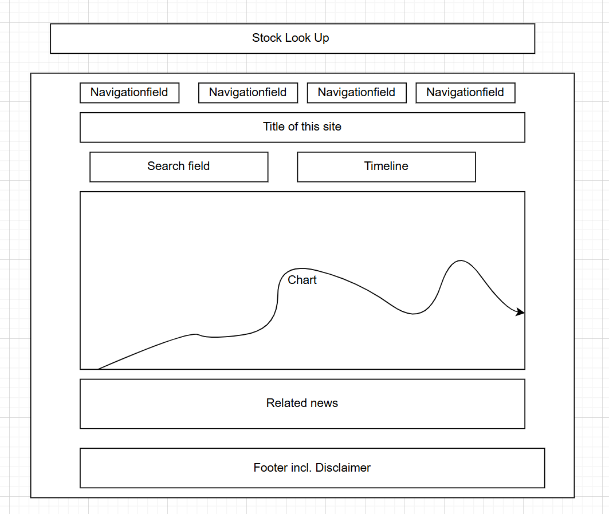
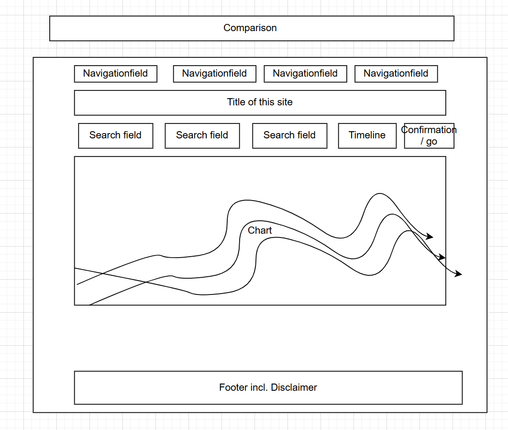

# Internet-Technology-Group-3 FinTrack

[](http://www.apache.org/licenses/LICENSE-2.0.html)

> 🚧: **This is a template project**: Make sure you adapt this documentation and the source code in this project according to your needs and use case. Comments are provided with "🚧:". Do not leave these comments in your final submission!

#### Contents:
- [Analysis](#analysis)
  - [Scenario](#scenario)
  - [User Stories](#user-stories)
  - [Use Case](#use-case)
- [Design](#design)
  - [Prototype Design](#prototype-design)
  - [Domain Design](#domain-design)
  - [Business Logic](#business-logic)
- [Implementation](#implementation)
  - [Backend Technology](#backend-technology)
  - [Frontend Technology](#frontend-technology)
- [Project Management](#project-management)
  - [Roles](#roles)
  - [Milestones](#milestones)

## Analysis
> 🚧: You can reuse the analysis (you made) from other projects (e.g., requirement engineering), but it must be submitted according to the following template. 


### Scenario

FinTrack is a Stock & Crypto News Hub, where the Users can acess charts and matching news to stay up to date with the latest moves in the market. 

### User Stories
1. As an Admin, I want to have a Web app to use on different mobile devices and desktop computers.
2. As an Admin, I want to see a consistent visual appearance to navigate easily, and it should look consistent.
4. As an Admin, I want to use edit and create views to maintain my business data.
5. As an Admin, I want to log-in so that I can authenticate myself.
6. As a User, I want to use list views so that I can access public pages.
7. As a User, I want to have access to the main page to view the latest stock/crypto news.
8. As a User, I want to click on a certain news that interests me to open the full article.
9. As a user, I want to enter certain crypto currencies or stocks provided by the API to visualize them on a graph.
10.As a user, I want to choose a different time range to adjust the period of the stocks/cryptos shown.
11.As a user, I want to compare different cryptos/stocks to visualize the different performance over a certain time window.
.

### Use Case




UC-1 [Ensure Responsive Web App]**  
- **Description**: Admin can access and use the web app on different mobile devices and desktop computers.  

UC-2 [Maintain Consistent UI Design]**  
- **Description**: Admin can ensure a visually consistent appearance to navigate easily.  

UC-3 [Manage Business Data Views]**  
- **Description**: Admin can create, edit, and delete views to maintain business data.  

UC-4 [Authenticate Admin]**  
- **Description**: Admin can log in to authenticate themselves and gain access to admin functionalities.  

UC-5 [Access Public Pages]**  
- **Description**: User can access list views to navigate public pages.  

UC-6 [View Stock/Crypto News]**  
- **Description**: User can access the main page to view the latest stock and crypto news.  

UC-7 [Read a News Article]**  
- **Description**: User can click on a specific news article to open and read the full content.  

UC-8 [Visualize Stock/Crypto Data]**  
- **Description**: User can enter cryptocurrencies or stocks provided by the API to visualize them on a graph.  

UC-9 [Adjust Time Range]**  
- **Description**: User can choose a different time range to adjust the period of the stocks/cryptos shown.  

UC-10 [Compare Multiple Stocks/Cryptos]**  
- **Description**: User can compare different stocks or cryptos to visualize their performance over a certain time window.  


---

Let me know if you need any refinements! 🚀

## Design
>  
 


### Wireframe / overview 
> 🚧: It is suggested to start with a wireframe. The wireframe focuses on the website structure (Sitemap planning), sketching the pages using Wireframe components (e.g., header, menu, footer) and UX. You can create a wireframe already with draw.io or similar tools. 

Starting from the home page, we can visit different pages. Available public pages are visible in the menu...



### Wireframes

<table>
  <tr>
    <td><br>Home</td>
    <td><br>About Us</td>
  </tr>
  <tr>
    <td><br>Look Up</td>
    <td><br>Comparison</td>
  </tr>
</table>


### Prototype
> 🚧: A prototype can be designed using placeholder text/figures in Budibase. You don't need to connect the front-end to back-end in the early stages of the project development.

### Domain Design
> 🚧: Provide a picture and describe your domain model; you may use Entity-Relationship Model or UML class diagram. Both can be created in Visual Paradigm - we have an academic license for it.

This Entity-Relationship Model shows of which entities our domain consists and how they interact with eachother.


There are 6 entities:
- A user can view and compare stocks/cryptocurrencies and read news articles.
- An admin manages the news and ensures the users access to the site.
- News Articles provide information by fetching information from an API.
- Stocks can be viewed either individually or can be compared.
- Cryptocurrencies can be viewed either individually or can be compared.
- APIs provide information for news articles and stocks.

The following relationships exist:
- A user can read multiple news articles
- An admin manages several news articles
- An admin ensures access for several users.
- A user can view/compare one or multiple stocks.
- A user can view/compare one or multiple cryptocurrencies.
- An API provides information for one or many stocks.
- An API provides information for one or many cryptocurrencies.
- News articles fetch information from APIs.


### Business Logic 
> 🚧: Describe the business logic for **at least one business service** in detail. If available, show the expected path and HTPP method. The remaining documentation of APIs shall be made available in the swagger endpoint. The default Swagger UI page is available at /swagger-ui.html.

Based on the use case 8, users can choose a specific stock/cryptocurrency from a dropdown-menu and see visualised data.

- Data will be retrieved from an API
- The graphs are adjustable, since different time periods or different stocks/cryptos can be chosen.

**Path**: [`/api/data/visualise`]

**Param**: "PLACEHOLDER".

**Method:** `GET`


Based on the use case 7, site visitors can read a news article.

- Articles should be reader friendly and include images, graphs, links, headings.
- The URLs are SEO-friendly and hence have a better search engine visibility.

**Path**: [`/api/news/{articleID}`]

**Param**: "PLACEHOLDER".

**Method:** `GET`


## Implementation
> 🚧: Briefly describe your technology stack, which apps were used and for what.

### Backend Technology
> 🚧: It is suggested to clone this repository, but you are free to start from fresh with a Spring Initializr. If so, describe if there are any changes to the PizzaRP e.g., different dependencies, versions & etc... Please, also describe how your database is set up. If you want a persistent or in-memory H2 database check [link](https://github.com/FHNW-INT/Pizzeria_Reference_Project/blob/main/pizza/src/main/resources/application.properties). If you have placeholder data to initialize at the app, you may use a variation of the method **initPlaceholderData()** available at [link](https://github.com/FHNW-INT/Pizzeria_Reference_Project/blob/main/pizza/src/main/java/ch/fhnw/pizza/PizzaApplication.java).

This Web application is relying on [Spring Boot](https://projects.spring.io/spring-boot) and the following dependencies:

- [Spring Boot](https://projects.spring.io/spring-boot)
- [Spring Data](https://projects.spring.io/spring-data)
- [Java Persistence API (JPA)](http://www.oracle.com/technetwork/java/javaee/tech/persistence-jsp-140049.html)
- [H2 Database Engine](https://www.h2database.com)

To bootstrap the application, the [Spring Initializr](https://start.spring.io/) has been used.

Then, the following further dependencies have been added to the project `pom.xml`:

- DB:
```XML
<dependency>
			<groupId>com.h2database</groupId>
			<artifactId>h2</artifactId>
			<scope>runtime</scope>
</dependency>
```

- SWAGGER:
```XML
   <dependency>
      <groupId>org.springdoc</groupId>
      <artifactId>springdoc-openapi-starter-webmvc-ui</artifactId>
      <version>2.3.0</version>
   </dependency>
```

### Frontend Technology
> 🚧: Describe your views and what APIs is used on which view. If you don't have access to the Internet Technology class Budibase environment(https://inttech.budibase.app/), please write to Devid on MS teams.

This Web application was developed using Budibase and it is available for preview at https://inttech.budibase.app/app/pizzeria. 

## Execution
> 🚧: Please describe how to execute your app and what configurations must be changed to run it. 

**The codespace URL of this Repo is subject to change.** Therefore, the Budibase PizzaRP webapp is not going to show any data in the view, when the URL is not updated or the codespace is offline. Follow these steps to start the webservice and reconnect the webapp to the new webservice url. 

> 🚧: This is a shortened description for example purposes. A complete tutorial will be provided in a dedicated lecture.

1. Clone PizzaRP in a new repository.
2. Start your codespace (see video guide at: [link](https://www.youtube.com/watch?v=_W9B7qc9lVc&ab_channel=GitHub))
3. Run the PizzaRP main available at PizzaApplication.java on your own codespace.
4. Set your app with a public port, see the guide at [link](https://docs.github.com/en/codespaces/developing-in-a-codespace/forwarding-ports-in-your-codespace).
5. Create an own Budibase app, you can export/import the existing Pizzeria app. Guide available at [link](https://docs.budibase.com/docs/export-and-import-apps).
6. Update the pizzeria URL in the datasource and publish your app.

### Deployment to a PaaS
> 🚧: Deployment to PaaS is optional but recommended as it will make your application (backend) accessible without server restart and through a unique, constantly available link.  

Alternatively, you can deploy your application to a free PaaS like [Render](https://dashboard.render.com/register).
1. Refer to the Dockerfile inside the application root (FHNW-INT/Pizzeria_Reference_Project/pizza).
2. Adapt line 13 to the name of your jar file. The jar name should be derived from the details in the pom.xml as follows:<br>
`{artifactId}-{version}.jar` 
2. Login to Render using your GitHub credentials.
3. Create a new Web Service and choose Build and deploy from a Git repository.
4. Enter the link to your (public) GitHub repository and click Continue.
5. Enter the Root Directory (name of the folder where pom.xml resides).
6. Choose the Instance Type as Free/Hobby. All other details are default.
7. Click on Create Web Service. Your app will undergo automatic build and deployment. Monitor the logs to view the progress or error messages. The entire process of Build+Deploy might take several minutes.
8. After successful deployment, you can access your backend using the generated unique URL (visible on top left under the name of your web service).
9. This unique URL will remain unchanged as long as your web service is deployed on Render. You can now integrate it in Budibase to make API calls to your custom endpoints.

## Project Management
> 🚧: Include all the participants and briefly describe each of their **individual** contribution and/or roles. Screenshots/descriptions of your Kanban board or similar project management tools are welcome.

### Roles
- Back-end developer: Charuta Pande 
- Front-end developer: Devid Montecchiari

### Milestones
1. **Analysis**: Scenario ideation, use case analysis and user story writing.
2. **Prototype Design**: Creation of wireframe and prototype.
3. **Domain Design**: Definition of domain model.
4. **Business Logic and API Design**: Definition of business logic and API.
5. **Data and API Implementation**: Implementation of data access and business logic layers, and API.
6. **Security and Frontend Implementation**: Integration of security framework and frontend realisation.
7. (optional) **Deployment**: Deployment of Web application on cloud infrastructure.


#### Maintainer
- Charuta Pande
- Devid Montecchiari

#### License
- [Apache License, Version 2.0](blob/master/LICENSE)
